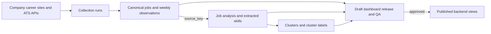
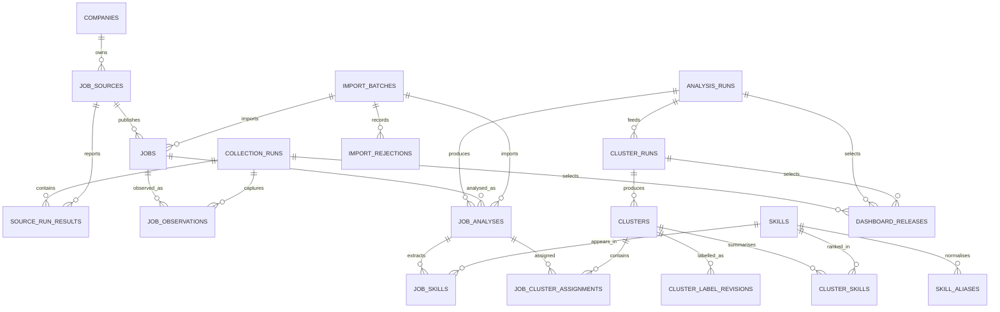

# AV Job Profiles Database Foundation

This directory defines the relational data contract between job collection,
classification, clustering, the backend API, and the dashboard.

## 1. Database scope and choice

The implementation target is **MySQL 8.0.16 or newer** because the current
data-collection README identifies MySQL as the intended database. The design
uses InnoDB tables, foreign keys, JSON columns, checks, indexes, and views. It
does not require vector storage. PostgreSQL remains a possible later migration
if embeddings become a confirmed requirement.

The database must:

1. preserve Li's original collected job facts and weekly history;
2. add Sunjol's derived AV relevance, seniority, skills, and clusters without
   overwriting the original job;
3. preserve LLM-generated and manually reviewed labels separately;
4. let Nyx validate and publish a complete, versioned dataset;
5. give Leon stable read-only views for backend development.

All application and database timestamps must use UTC.

## 2. End-to-end data flow

The 4,163 collected records do not go directly into one large Dashboard table.
They pass through five stages. Each stage adds information while keeping the
previous stage traceable.



### Stage 1: collect and standardise jobs

Li's pipeline collects job advertisements from multiple companies and
Applicant Tracking Systems (ATSs). It standardises them into the same source
fields: title, description, URL, location, salary, posting date, company,
platform, and history status.

The database update is:

```text
collection_runs
  -> source_run_results
  -> companies and job_sources
  -> jobs                     latest known version
  -> job_observations         immutable per-run history
```

All 4,163 canonical records can be loaded into `jobs`, even if classification
has not finished. `jobs` remains the source of truth for what was actually
advertised.

### Stage 2: classify each job and extract skills

The classification process reads the canonical job description. Depending on
the chosen approach, an LLM or dictionary/rule pipeline produces derived data:

- AV relevance and evidence;
- generic job title;
- seniority and experience;
- tools, domain skills, and qualifications.

The classifier must return the original `source_key`. The importer resolves it
to one internal `job_id` and writes:

```text
analysis_runs
  -> job_analyses
       -> job_skills
            -> skills and skill_aliases
```

The job remains one row in `jobs`. Its many skills become separate relational
links in `job_skills`; the description and URL are not copied into every skill
row.

Current classification samples cover fewer jobs than the 4,163 canonical
records. A job without a matched analysis remains in `jobs` and is counted as
unclassified. A classification row without an exact `source_key` match goes to
`import_rejections`; it is never matched by row number or similar title.

### Stage 3: place analysed jobs into clusters

Clustering uses the complete analysis snapshot and extracted skills. It groups
similar jobs and records both membership and cluster-level evidence:

```text
cluster_runs
  -> clusters
       -> job_cluster_assignments
       -> cluster_skills
       -> cluster_label_revisions
```

For example, hundreds of individual advertisements may be grouped into a
`Motion Planning` cluster. The cluster stores representative terms and skills;
each job stores only its assignment to that cluster for that run.

LLM labelling and manual labelling both create append-only rows in
`cluster_label_revisions`. They do not overwrite each other. `clusters` caches
only the approved current label for fast Dashboard reads.

### Stage 4: relate collection and classification data

Li's collection data and Sunjol's classification data are **linked**, not
blindly flattened or allowed to overwrite one another:

```text
Li's jobs.source_key = Sunjol's classification.source_key
```

Li's side supplies verifiable source facts:

- original title and full description;
- job URL, location, salary, and posting date;
- company, platform, source ID, and collection history;
- active, new, and removed status.

Sunjol's side supplies derived interpretation:

- AV relevance;
- generic title, seniority, and experience;
- extracted and normalised skills;
- cluster assignment and proposed cluster labels.

Neither side is sufficient by itself. Collection-only data has no useful skill
or cluster analysis; classification-only data may lack the source URL, full
description, history, and currently covers only part of the dataset. Relating
them lets the Dashboard show an original advertisement together with its
classification and skills.

### Stage 5: assemble, check, and publish a Dashboard release

Nyx registers one collection/analysis/cluster combination in
`dashboard_releases` with `status = 'draft'`. A draft is a candidate dataset;
it is not visible through the public Dashboard views.

Before publishing, Nyx reports these Quality Assurance (QA) counts:

- total and active jobs;
- successfully matched analyses and unclassified jobs;
- rejected rows and duplicate keys;
- jobs without skills;
- noise-cluster jobs;
- cluster-size versus assignment-count mismatches;
- missing or unapproved cluster labels.

After the responsible owners approve their outputs, the old release changes
from `published` to `retired`, and the validated draft becomes `published`.
The backend views automatically expose only the published release.

## 3. How one job is split and linked

The relational model separates facts that change for different reasons. It
does not create unrelated copies of the job.

Suppose the collection pipeline returns this advertisement:

```text
source_key: greenhouse|waymo|id:123
title: Motion Planning Engineer
company: Waymo
description: ...
```

After processing, it is represented as:

| Layer | Example row | Relationship |
| --- | --- | --- |
| Canonical job | `jobs.job_id = 101`, `source_key = greenhouse|waymo|id:123` | One stable job |
| Collection history | job 101 was seen in collection runs 20, 21, and 22 | One job to many observations |
| Analysis | job 101 was analysed in analysis run 8 | One job to one result per analysis run |
| Skills | analysis result requires Python, C++, and Motion Planning | One analysis to many skills; one skill to many analyses |
| Cluster assignment | analysis result belongs to cluster 29 in cluster run 5 | One analysed job to one cluster per cluster run |
| Cluster | cluster 29 contains many similar jobs | One cluster to many assignments |
| Label history | LLM proposal, manual correction, approved label | One cluster to many label revisions |

The complete path used by the Dashboard is:

```text
jobs.job_id
  -> job_analyses.job_id
  -> job_skills.job_analysis_id
  -> job_cluster_assignments.job_analysis_id
  -> clusters.cluster_pk
  -> cluster_label_revisions.cluster_pk
```

The base job is therefore supplemented rather than replaced. A Dashboard row
is reconstructed through relationships:

```text
original job
+ latest approved analysis snapshot
+ normalised skills
+ cluster assignment
+ approved cluster label
```

### Why skills are separate rows

A semicolon string such as `Python; C++; ROS` is easy to display but difficult
to filter or count correctly. The relational form is:

```text
job analysis 8001 -> Python
job analysis 8001 -> C++
job analysis 8001 -> ROS
```

This supports queries such as "top skills", "jobs requiring Python", and
"skills shared across companies" without parsing text in every request.

### Why labels are not repeated on every job

The cluster name belongs to the cluster, not each individual job. If a reviewer
changes `Autonomous Systems` to `Motion Planning and Prediction`, one approved
cluster label changes; hundreds of job rows do not need to be rewritten.

## 4. Table contents and relationships

This section is the human-readable table dictionary. `schema.mysql.sql` remains
the authority for exact SQL types, nullability, indexes, and constraints.

### 4.1 Import audit tables

| Table | Purpose | Main contents | Relationship and writer |
| --- | --- | --- | --- |
| `import_batches` | Record and audit every file/database load so an import can be reproduced and checked. | `import_batch_id`, batch type, source filename, SHA-256 checksum, status, total/accepted/rejected counts, metadata and timestamps. | Parent of imported `jobs`, `job_analyses`, and rejection rows. Written by Nyx's importer. |
| `import_rejections` | Keep invalid rows and explicit failure reasons instead of silently dropping or guessing data. | Rejection ID, batch ID, input row number, optional `source_key`, error code/message, and original row as JSON. | Many rejection rows belong to one `import_batches` row. Written only by the importer/validator. |

These tables explain where database rows came from and prevent invalid data
from disappearing silently.

### 4.2 Collection and job-history tables

| Table | Purpose | Main contents | Relationship and writer |
| --- | --- | --- | --- |
| `companies` | Provide one canonical company identity instead of repeating inconsistent company names in every job. | Numeric `company_id`, canonical name, slug, optional website and headquarters country. | One company has many `job_sources`. Maintained by Li's source configuration/import process. |
| `job_sources` | Describe each configured careers source from which jobs are collected. | Stable `source_id`, `company_id`, platform/ATS, region, endpoint, enabled flag and source configuration JSON. | One source belongs to one company and publishes many `jobs`; it also has one result per collection run. Written from the checked source configuration. |
| `collection_runs` | Version one complete or partial execution of the collection pipeline. | Run ID/key, status, pipeline version, Git commit, source scope, notes, start/end timestamps. | Parent of `source_run_results` and `job_observations`. Written once per collection execution. |
| `source_run_results` | Distinguish a genuinely removed job from a source that simply failed during collection. | Composite run/source key, success/failure/skipped status, job count, error message, snapshot path and completion time. | Joins `collection_runs` to `job_sources`. Written by Li's collection pipeline. |
| `jobs` | Store the latest canonical state of every known source advertisement for fast backend access. | Internal `job_id`, unique `source_key`, source job ID, title, description, URL, raw/normalised location, raw/normalised salary, posting/seen/collection dates, active/new flags and content hash. | One job belongs to one source and has many observations and analysis versions. Upserted by the collection importer; classification must not overwrite it. |
| `job_observations` | Preserve what one job looked like in each collection run for history, change detection and trend charts. | Observation ID, job/run IDs, title, description, URL, raw location/salary, posting and collection dates, active-at-run flag, content hash and optional raw payload. | Unique per `(job_id, collection_run_id)`. Appended by the collection importer and never edited as current state. |

`jobs` is optimised for current Dashboard reads. `job_observations` preserves
history for trend charts, auditing, and detecting changed/removed jobs.

### 4.3 Classification and skill tables

| Table | Purpose | Main contents | Relationship and writer |
| --- | --- | --- | --- |
| `analysis_runs` | Make each LLM, dictionary, hybrid or manual classification reproducible and distinguishable from later versions. | Run ID/key, method, provider/model/version, prompt/taxonomy/code versions, source dataset version, parameters, status, notes and timestamps. | One run produces many `job_analyses` and may feed clustering. Created by Sunjol's classification process. |
| `job_analyses` | Store derived interpretation of one canonical job without changing the source job. | Analysis ID, job/run IDs, result origin and reuse pointer, AV relevance/confidence/reason, responsibilities/evidence, generic title, seniority, experience, raw model response, status and import batch. | Unique per `(job_id, analysis_run_id)`; parent of `job_skills` and cluster assignments. Written by the classifier/importer. |
| `skills` | Maintain a reusable canonical vocabulary so equivalent skills can be counted consistently. | Numeric `skill_id`, canonical and normalised names, skill type, description and active flag. | Referenced by both `job_skills` and `cluster_skills`. Maintained by the classification/taxonomy process. |
| `skill_aliases` | Map alternative text forms to one canonical skill without losing the form found in source/model output. | Alias ID, `skill_id`, original alias text, normalised alias and alias source. | Many aliases belong to one `skills` row. Maintained with the skill taxonomy. |
| `job_skills` | Represent the many-to-many relationship between analysed jobs and skills for filtering and aggregation. | `job_analysis_id`, `skill_id`, raw extracted text, confidence, evidence and rank. | Composite key `(job_analysis_id, skill_id)`. Written when an analysis result is loaded; never stored as one semicolon string. |

`job_analyses.result_origin` records whether a result was newly generated,
reused, manually corrected, or imported. `reused_from_job_analysis_id` points
to the previous result when unchanged jobs are copied into a complete new
snapshot without another LLM call.

### 4.4 Clustering and label tables

| Table | Purpose | Main contents | Relationship and writer |
| --- | --- | --- | --- |
| `cluster_runs` | Version the grouping operation because cluster numbers and membership can change when data or algorithms change. | Run ID/key, source analysis run, algorithm/version, requested/produced counts, noise flag, parameters, status, notes and timestamps. | One cluster run belongs to an analysis snapshot and produces many `clusters`. Written by the clustering process. |
| `clusters` | Store one algorithmic group and cache the currently approved human-readable interpretation for Dashboard performance. | Internal `cluster_pk`, run-scoped number, current label pointer/cache, job family, specialisation, lean, noise flag, cached size, technical score, top terms/examples/companies and notes. | Unique per `(cluster_run_id, cluster_number)`; parent of assignments, cluster skills and label revisions. Algorithmic fields come from clustering; approved cache changes only through label approval. |
| `job_cluster_assignments` | State which cluster contains one analysed job in a particular clustering run. | Analysis ID, analysis/cluster run IDs, cluster PK, membership/distance scores and assignment time. | Unique per `(job_analysis_id, cluster_run_id)`. Written by the clustering process; manual naming must not change it. |
| `cluster_skills` | Store the ranked skills that characterise a cluster without repeating them in the cluster row. | `cluster_pk`, `skill_id`, rank, score and number of jobs containing the skill. | Composite key `(cluster_pk, skill_id)` linking clusters to canonical skills. Written by clustering/summary generation. |
| `cluster_label_revisions` | Preserve every LLM proposal, manual label, correction and review decision. | Revision ID/number, cluster PK, source/status, proposed name/family/specialisation, rationale, model/prompt provenance, labeler/reviewer, notes and timestamps. | Many immutable revisions belong to one cluster. LLM/manual processes append proposals; approval updates only the current-label pointer/cache in `clusters`. |

`cluster_number` is not a permanent global ID. It is unique only inside one
`cluster_run_id`. Cluster `29` in a later run may represent a different group.

### 4.5 Dashboard publication table

| Table | Purpose | Main contents | Relationship and writer |
| --- | --- | --- | --- |
| `dashboard_releases` | Select one mutually consistent collection, analysis and clustering version for public Dashboard reads. | Release ID/key, collection/analysis/cluster run IDs, data cutoff date, draft/published/retired status, publication time and notes. | References the three versioned stages. Nyx creates drafts and changes status only after QA/owner approval; backend views read the single published row. |

Only one release can be `published`. Incomplete runs can remain stored without
becoming visible to Dashboard users.

## 5. Job identity and duplicate protection

`jobs.job_id` is the internal primary key. It is a database-generated number
used for efficient foreign-key joins and has no external meaning.

`jobs.source_key` is the stable external/business key produced by the
collection pipeline. It combines platform, company, and source job ID. When a
source job ID is unavailable, the pipeline falls back to job URL or finally to
title/location.

The database enforces:

```text
PRIMARY KEY (job_id)
UNIQUE (source_key)
UNIQUE (source_id, source_job_id) when a source job ID exists
```

Importing the same source job twice is therefore rejected or handled as an
update rather than creating a second `jobs` row. The current history contains
4,163 records and 4,163 unique `source_key` values.

Other repeatable data is scoped by version:

- one observation per `(job_id, collection_run_id)`;
- one analysis per `(job_id, analysis_run_id)`;
- one skill link per `(job_analysis_id, skill_id)`;
- one cluster number per `(cluster_run_id, cluster_number)`;
- one cluster assignment per `(job_analysis_id, cluster_run_id)`;
- one label revision number per `(cluster_pk, revision_number)`.

This guarantees source-level uniqueness, not real-world cross-platform
deduplication. The same vacancy mirrored on two different platforms may have
two `source_key` values. It must not be merged automatically by title alone;
a future deduplication layer can group such records while preserving both
source advertisements.

## 6. Intentional redundancy and version preservation

The design duplicates selected data only when it improves speed, history, or
reproducibility:

- `jobs` caches latest values; `job_observations` preserves every run;
- a complete new analysis snapshot reuses unchanged results, while
  `reused_from_job_analysis_id` preserves their origin;
- `clusters` caches the approved label; `cluster_label_revisions` preserves all
  LLM and manual proposals;
- cluster size/top terms are cached because they are expensive analysis outputs;
- raw model response, evidence, source text, and rejected rows are retained for
  investigation.

Old analysis runs, cluster runs, assignments, label revisions, and retired
Dashboard releases are immutable. A new result creates a new run or revision;
it does not rewrite evidence behind an older release.

## 7. Entity relationship diagram



## 8. Responsibilities and table ownership

The names below reflect the current allocation. If a person changes, ownership
must transfer by role; it must not become shared direct-write access.

| Role | Current owner | May write | Reads | Must not do |
| --- | --- | --- | --- | --- |
| Data collection owner | Li | `companies`, `job_sources`, `collection_runs`, `source_run_results`, `jobs`, `job_observations` through the collection/import process | collection tables and import reports | Write relevance, skills, clusters, labels, or release status |
| Classification and clustering owner | Sunjol | `analysis_runs`, `job_analyses`, `skills`, `skill_aliases`, `job_skills`, `cluster_runs`, algorithmic fields in `clusters`, `job_cluster_assignments`, `cluster_skills`, LLM proposals in `cluster_label_revisions` | canonical jobs and previous analysis results | Change canonical job text/history, approve a label alone, or publish a release |
| Manual label reviewer | designated team/client-approved reviewer | new rows and review status in `cluster_label_revisions`; approved-label cache in `clusters` through one controlled transaction | terms, examples, skills, titles and previous revisions | Edit/delete an older revision, change membership, or change extracted skills while naming a cluster |
| Database and integration owner | Nyx | schema migrations, importers, `import_batches`, `import_rejections`, validated loads, draft releases and approved publication operation | every table for validation/integration | Invent relevance, skills, membership or labels; silently repair rejected rows |
| Backend owner | Leon | normally no analytical table writes; optionally an authorised release transaction; application-only tables belong in a separate schema | four `v_dashboard_*` views; authorised detail fields | Directly update collection, analysis, skill, cluster or label tables from public requests |
| Frontend owner | frontend team | no database tables | backend API only | Connect directly to MySQL or embed credentials |

### Nyx's database and integration scope

Nyx is responsible for the boundary between team outputs and the backend:

- maintain schema, migrations, constraints, indexes, views, and field mapping;
- import Li's canonical jobs first and join Sunjol's results only by `source_key`;
- split skills, validate coverage/cluster counts, and record rejected rows;
- register candidate runs as a draft Dashboard release;
- report total, matched, unclassified, rejected, duplicate, skill-missing,
  noise-cluster, and cluster-mismatch QA counts;
- publish only after data/classification owners approve their outputs;
- give Leon stable views and announce breaking changes.

Nyx does not decide whether a job is AV-related, select the correct skill, name
a cluster, or change client-facing definitions. Those decisions come from the
responsible owner and are loaded with provenance.

## 9. Update workflows

### 9.1 Collection-only update

1. Li creates `collection_runs` and one `source_run_results` row per source.
2. The importer upserts `jobs` and appends immutable `job_observations`.
3. Older jobs are marked inactive only for sources that completed successfully.
4. Analysis, skills, clusters, labels, and the published release remain unchanged.
5. The Dashboard continues using the previous published release.

### 9.2 LLM classification and LLM labelling

1. Create a new `analysis_runs` row with model, prompt, taxonomy, code,
   parameters, and source dataset version.
2. Send only new/changed jobs to the LLM. Insert their `job_analyses` and
   `job_skills` with `result_origin = 'generated'`; preserve `raw_response_json`.
3. Copy unchanged analyses/skills into the complete new snapshot with
   `result_origin = 'reused'` and `reused_from_job_analysis_id`.
4. Create new `cluster_runs`, `clusters`, assignments, and cluster skills.
5. Insert each LLM name into `cluster_label_revisions` as `llm/proposed`.
6. A reviewer approves, rejects, or replaces the proposal. Approval updates the
   current-label pointer/cache in `clusters` in one transaction.
7. Nyx validates, creates a draft release, and publishes after team approval.

Prior analyses, raw responses, clusters, assignments, label proposals, and
retired releases remain stored.

### 9.3 Non-LLM extraction with manual cluster labelling

1. Create `analysis_runs.method = 'dictionary'` or `hybrid` with code/taxonomy
   versions.
2. Insert complete analyses and skills; reuse unchanged results where possible.
3. Create a new cluster run and preserve parameters, terms, examples, noise,
   assignments, and cluster skills.
4. A reviewer inserts a `manual/proposed` label revision. Naming changes only
   interpretation, not membership, terms, or job skills.
5. The agreed review process approves it and updates the cluster label cache.
6. Nyx validates and publishes through the same draft-release process.

Moving jobs between clusters is not labelling. It requires a new manual/hybrid
cluster run.

### 9.4 Manual correction after an LLM label

Do not edit the LLM revision. Insert a new manual/hybrid revision with a
rationale, approve it, and update the cluster cache. The Dashboard shows the
approved manual label while retaining the original LLM proposal.

### 9.5 Manual correction of job-level analysis

Label revisions cannot change relevance, seniority, experience, or skills.
Create a new complete manual/hybrid analysis run, reuse unaffected results,
insert corrections, rerun clustering, and publish a new release.

## 10. Backend contract

The backend reads the views in `views.mysql.sql`:

- `v_dashboard_jobs`: job list, filters, classification, and current cluster;
- `v_dashboard_job_skills`: job-to-skill details;
- `v_dashboard_skill_demand`: aggregate skill demand;
- `v_dashboard_clusters`: cluster cards, labels, and summaries.

The public backend is read-only. It must not update canonical jobs, model
outputs, skills, assignments, or labels from public API handlers. If an
internal admin endpoint is later approved, it must call a controlled service
transaction rather than expose generic table editing.

Backend schema changes are limited to proposing new views/indexes/fields,
maintaining backend-only operational tables in a separate schema, and performing
release status changes only when explicitly delegated.

Suggested API mapping:

| Endpoint | Primary database source |
| --- | --- |
| `GET /jobs` | `v_dashboard_jobs` |
| `GET /jobs/{source_key}` | `v_dashboard_jobs` plus `v_dashboard_job_skills` |
| `GET /skills` | `v_dashboard_skill_demand` |
| `GET /clusters` | `v_dashboard_clusters` |
| `GET /companies` | distinct companies from `v_dashboard_jobs` |
| `GET /trends` | `job_observations` grouped by collection run/date |

## 11. Extending for Dashboard and new business requirements

The read-only backend rule applies to the **core analytical tables**. It does
not prevent the Dashboard team from adding application features or new tables.
New data must be placed according to ownership and source of truth.

### 11.1 Schema boundaries

Use three logical MySQL schemas/databases:

| Schema | Owner | Purpose | Backend permission |
| --- | --- | --- | --- |
| `av_job_profiles` | data/classification/integration owners | canonical jobs, history, analyses, skills, clusters, releases | `SELECT` through views; no public-request writes |
| `av_job_dashboard` | backend team | users, favourites, saved filters, API keys, UI preferences and application state | normal backend CRUD |
| `av_job_reporting` | backend + database integration | rebuildable aggregate/cache tables for expensive charts | controlled rebuild/write, normal read |

Separating schemas prevents a user clicking "favourite" from accidentally
changing a canonical job or model result. It also lets the backend team develop
new features without waiting for changes to the classification pipeline.

### 11.2 Where a new requirement belongs

| New requirement | Correct location | Example |
| --- | --- | --- |
| New field supplied by a careers source | core collection table and importer | company logo URL, employment type |
| New model/classification output | versioned core analysis tables | education level, job-function taxonomy |
| New cluster interpretation | `cluster_label_revisions` | client-approved cluster name |
| User or application state | `av_job_dashboard` | favourites, saved searches, personal notes |
| Expensive derived chart data | `av_job_reporting` | daily skill counts, monthly company trends |
| Display-only combination of existing data | new read view | jobs with company and approved cluster label |
| Temporary experiment | staging table or separate experiment schema | trial scoring model output |

Do not add a column to `jobs` merely because one page needs it. First decide
whether the value is a source fact, derived analysis, user-owned state, or a
rebuildable reporting result.

### 11.3 Example Dashboard-owned tables

The backend team may create tables such as:

```text
av_job_dashboard.users
av_job_dashboard.user_favourites
av_job_dashboard.saved_searches
av_job_dashboard.dashboard_preferences
av_job_dashboard.api_audit_log

av_job_reporting.skill_demand_daily
av_job_reporting.company_job_counts_daily
av_job_reporting.cluster_summary_cache
```

When the application schema is hosted in the same MySQL instance, a favourite
may store `job_id` and use a foreign key to `av_job_profiles.jobs`. If services
or databases are deployed separately, store the stable `source_key` and resolve
the job through the backend API instead of creating a cross-database foreign
key.

### 11.4 Change process

Every new table or core-column change requires a migration reviewed through
GitHub. The proposal must state:

1. business requirement and API/UI consumer;
2. table owner and the only process allowed to write it;
3. source of truth and update frequency;
4. primary key, foreign keys, indexes, retention, and sensitive-data impact;
5. whether the data is canonical, derived, user-owned, or rebuildable;
6. backfill and rollback plan;
7. whether existing backend views or API responses change.

Prefer backward-compatible changes: add a nullable field/table first, deploy
writers, backfill and validate, then add stricter constraints. Never edit the
production schema manually without a recorded migration.

### 11.5 Backend write boundary after extension

Leon/backend may freely maintain approved tables in `av_job_dashboard` and
rebuild agreed `av_job_reporting` tables. The backend still must not directly
write `av_job_profiles.jobs`, `job_analyses`, `job_skills`, clusters, or label
history. A genuinely new core business requirement is implemented through a
reviewed core migration and assigned to the relevant data owner.

## 12. Required import order

Use one transaction per batch where practical:

1. `import_batches`
2. `companies`
3. `job_sources`
4. `collection_runs` and `source_run_results`
5. `jobs` and `job_observations`
6. `analysis_runs` and `job_analyses`
7. `skills`, `skill_aliases`, and `job_skills`
8. `cluster_runs`, `clusters`, assignments, and `cluster_skills`
9. `cluster_label_revisions`, then the approved label cache in `clusters`
10. draft `dashboard_releases`
11. QA validation, approval, and publication

## 13. Non-negotiable data rules

- Join collection and analysis using `source_key`, never row number or fuzzy title.
- Keep original source text even when normalised fields exist.
- Keep noise cluster `-1`; do not silently discard it.
- Treat `cluster_number` as scoped to one cluster run.
- Do not turn `High` into an invented numeric confidence.
- Split semicolon-delimited skills before loading `job_skills`.
- A failed source run must not deactivate every older job from that source.
- LLM/manual labels are append-only; approval changes only current cache/pointer.
- Publish only completed, fully validated runs.

## 14. Files and deployment

- `schema.mysql.sql`: tables, keys, constraints, and indexes.
- `views.mysql.sql`: stable read contract for the backend.
- `SOURCE_MAPPING.md`: field-level mapping from current team files.

```bash
mysql -u USER -p < database/schema.mysql.sql
mysql -u USER -p < database/views.mysql.sql
```

Database credentials must come from environment variables or the deployment
platform's secret manager. They must not be committed to GitHub.
